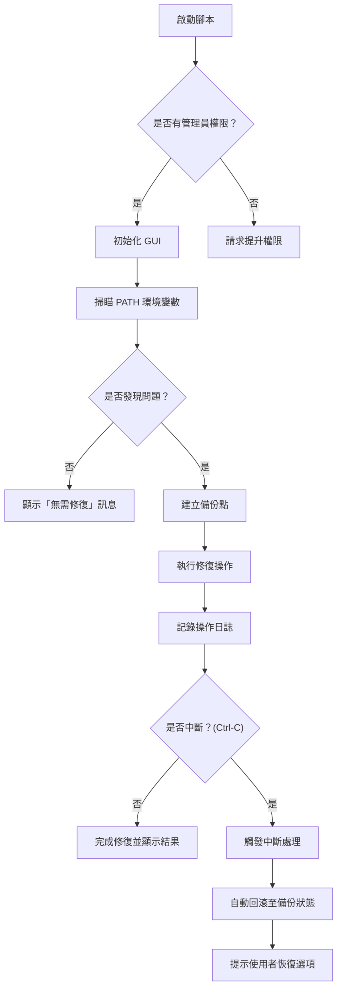

## PATH_Tool_Diagnostic_Repair_Safe.ps1 - 操作流程圖

```mermaid
flowchart TD
    A[啟動腳本] --> B{是否有管理員權限？}
    B -- 是 --> C[初始化 GUI]
    B -- 否 --> D[請求提升權限]
    C --> E[掃瞄 PATH 環境變數]
    E --> F{是否發現問題？}
    F -- 否 --> G[顯示「無需修復」訊息]
    F -- 是 --> H[建立備份點]
    H --> I[執行修復操作]
    I --> J[記錄操作日誌]
    J --> K{"是否中斷？(Ctrl-C)"}  
    K -- 否 --> L[完成修復並顯示結果]
    K -- 是 --> M[觸發中斷處理]
    M --> N[自動回滾至備份狀態]
    N --> O[提示使用者恢復選項]
```
