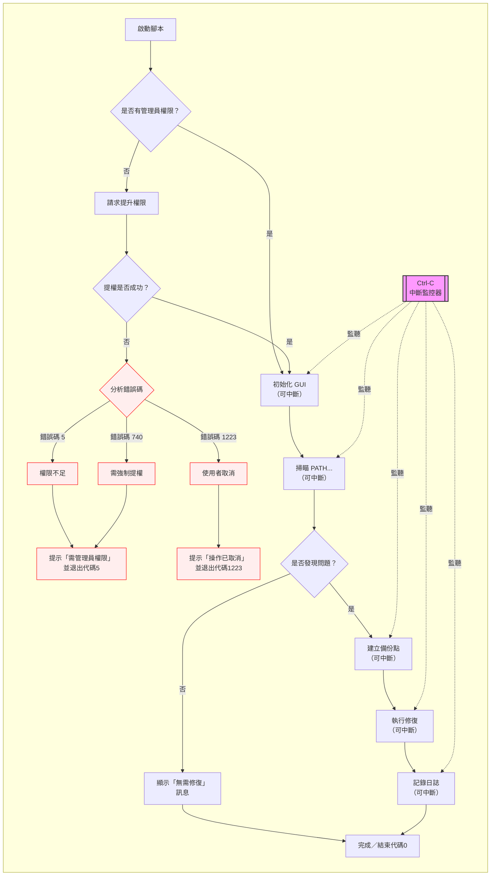

## PATH_Tool_Diagnostic_Repair_Safe.ps1 - 操作流程圖

```mermaid
flowchart TD
    subgraph 全程監控區[" "]
        direction TB
        Z[["Ctrl-C<br>中斷監控器"]]:::monitor
        A[啟動腳本] --> B{是否有管理員權限？}
        B -- 是 --> C[初始化 GUI<br>（可中斷）]
        B -- 否 --> D[請求提升權限]
        D --> D1{提權是否成功？}
        D1 -- 是 --> C
        D1 -- 否 --> E1{分析錯誤碼}
        
        E1 -->|錯誤碼 5| E2[權限不足]
        E1 -->|錯誤碼 740| E3[需強制提權]
        E1 -->|錯誤碼 1223| E4[使用者取消]
        E2 --> E5[提示「需管理員權限」<br>並退出代碼5]
        E3 --> E5
        E4 --> E6[提示「操作已取消」<br>並退出代碼1223]
        
        C --> E[掃瞄 PATH...<br>（可中斷）]
        E --> F{是否發現問題？}
        F -- 是 --> H[建立備份點<br>（可中斷）]
        F -- 否 --> G[顯示「無需修復」<br>訊息]
        G --> L[結束退出代碼0]
        H --> I[執行修復<br>（可中斷）]
        I --> J[記錄日誌<br>（可中斷）]
        J --> L[完成／結束代碼0]
    end
    
    Z -.->|監聽| C
    Z -.->|監聽| E
    Z -.->|監聽| H
    Z -.->|監聽| I
    Z -.->|監聽| J
    
    classDef monitor fill:#f9f,stroke:#333,stroke-width:2px
    classDef error fill:#ffeeee,stroke:#ff0000
    class E1,E2,E3,E4,E5,E6 error
```
